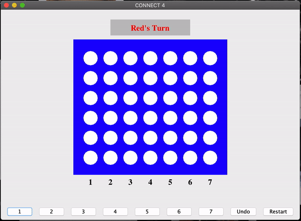
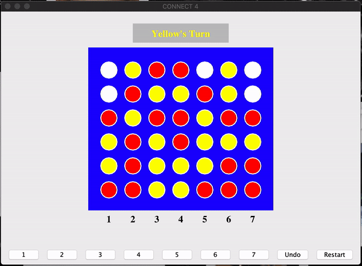
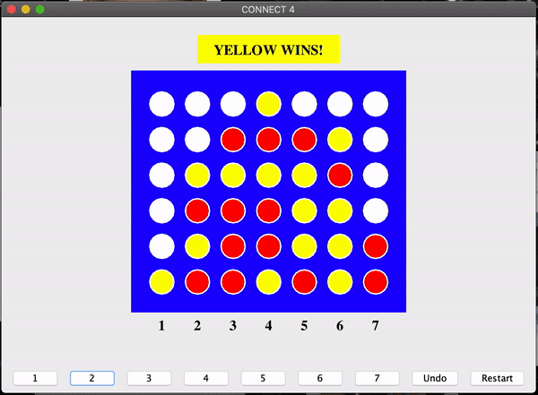
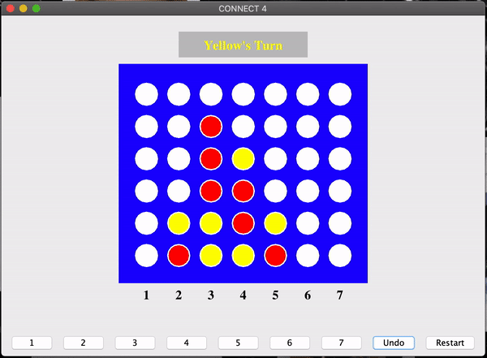

# Connect 4

### [See Demos](#short-game)

### DESCRIPTION

- This Connect 4 game has a GUI which prompts users to play the classic game, Connect 4, by selecting which column they would like to place their piece in.
- There is an undo button which undoes any number of moves, and a restart button, which restarts the entire game.
- The UI gives the user feedback on who's turn it is, if someone has won, and if the game has ended in a tie.
  - It also gives feedback when users make illegal moves, such as placing a piece in a column that is full, pressing undo before any moves have been made, or trying to place a piece after the game is over.
 

### FILE INFO

- [**GameState.java**](GameState.java) keeps track of:
  - whose turn it is
  - where all the pieces are
  - all previous moves
  - error messages corresponding to invalid moves
  - if a player has won
  - if the game has ended in a tie
- [**BoardDrawing.java**](BoardDrawing.java) draws:
  - the board
  - the pieces
  - a banner indicating whose turn it is or who has won
  - any error messages
- [**Connect4UI.java**](Connect4UI.java) deploys the game in a window using swing components.
 

### TO PLAY

Download the three java files into the same directory, compile them all, and run [**Connect4UI.java**](Connect4UI.java):
> `$ javac *.java` 
> `$ java Connect4UI`
 

   
  <h2>Short Game</h2>
  
   
   
  <h2>Game Ends In Tie</h2>
  
   
   
  <h2>Undo & Restart Functionality</h2>
  
   
   
  <h2>Error Messages for Illegal Moves</h2>
  

